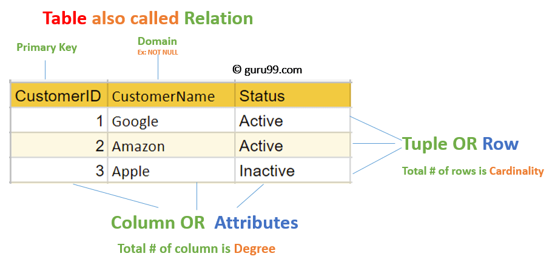
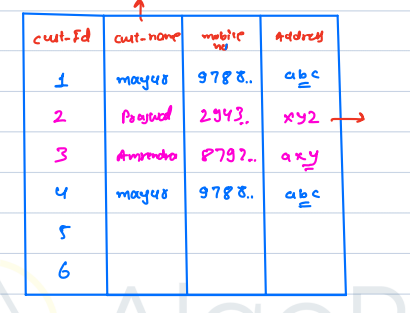
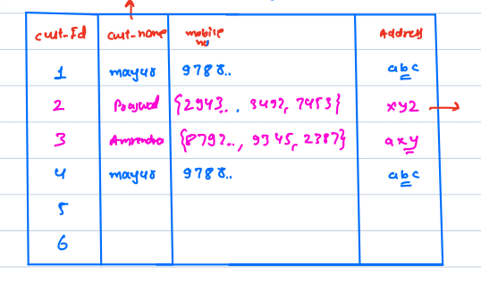
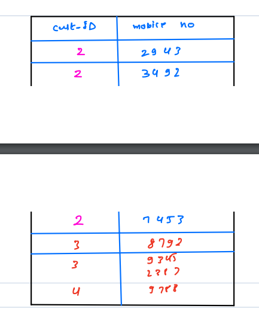

# Introduction to DBMS

### Database
- **Data** 
    - Data refers to raw facts.
    - Information about something
- **Database** is place where related data is stored. A colloection of related data.

#### Database Management System
- It is a software system that enables users to define, create, and maintain database.

### File System vs DBMS
- File systems can behaves like a DBMS.
- It stores data in hierarchical form (Graph)
#### Problems with file system
- **Retrival of data is tough**
    - Searching for data in file system is tough.
    - That where DMBS comes into action it efficent in searching data.
- **Data Redundancy and inconsistance**
    - Data redundancy means duplication of data in file system, redundant data will consume more space. DBMS helps prevent data redundancy.
    - Data inconsistance happens when there are conflicts or different copies of the same data in the database.
    - Consider an ecommerce store, there are 2 two file one containing the customer details and the contains the transactions. When a customer purschases a product the customer details along with the product details get added to the transaction file. Suppose, the customer changes the address, the address get replaced in the customer file but the for transaction file if the transaction has been already processed then, that particular transaction will contain the old address, this will create a data inconsistancy.
- **Security and Access control**
    - file system can be accessed by anyone who has access to the system.
    - In case of DBMS, we can limit access to the database, for certain database only a certain set of people has access. 
- **Concurrency Controll**
    - Concurrency - multiple users can access data at the same time.
    - In file system multiple users cannot access at the same.
    - DBMS manages concurrent access to data by multiple users or transaction.

### Types of Databases
1. **Relation Database**
    - **MySQL** is database and **SQL(Structured Query Language)** is language used to query the MySQL database.
    - Data is stored in the form of a **table** consisting of **rows** and **columns**
    - **Table** is also called as **Relation**.
    - **Columns** are also called as **fields** or **attributes** is the characteristics of the entities.
    - **Rows** are alse called as **tuples** or **records** represents individual instance of data of entity.
    
    - **Degree** is the number of **attributes/colums**.
    - **Cardinality** is the number of **tuples/rows**.

#### Properties/Rules of Relation/Table
1. Each row is unique
    - For a row to be unique atleast one attribute must be unique.
    
2. Each cell can only contain a single value.
    - A cell can't contain any list/collection of data
    
    - To Resolve this we can create an another table for mobile numbers
    
3. Order of the columns shouldn't matter.
4. Order of the rows Shouldn't matter.